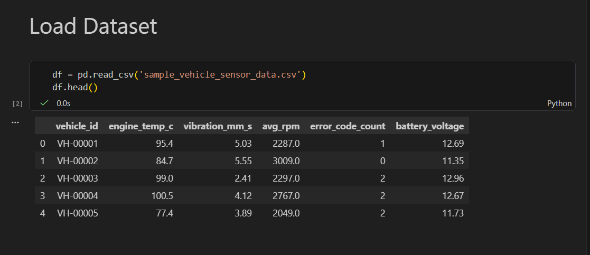
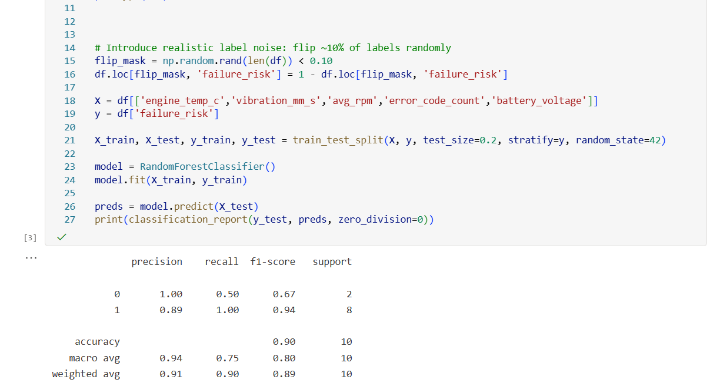
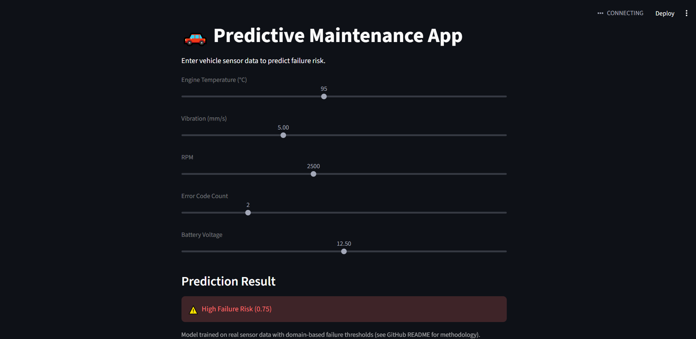

# 🚗 Predictive Maintenance for Fleet Vehicles

## 📌 Overview
This project demonstrates an end-to-end machine learning pipeline to predict potential vehicle failures using sensor data.

It covers:
- Data preprocessing
- Model development
- Evaluation
- Deployment using Streamlit

---

## 📁 Project Structure

```
predictive_maintenance_ML/
│
└── Predictive-maintenance-ML/
    ├── Notebook/
    │   └── Predictive_Maintenance_Notebook.ipynb
    ├── Data/
    │   └── sample_vehicle_sensor_data.csv
    ├── Images/
    │   ├── Dataset.png
    │   ├── Model_output.png
    │   └── Streamlit_app.png
    ├── Streamlit_App/
    │   └── app.py
    ├── requirements.txt
    └── README.md
```

---

## 🎯 Problem Statement

Fleet vehicles often experience unexpected failures due to lack of predictive insights, leading to:
- Increased downtime
- Higher maintenance costs
- Operational inefficiencies

👉 This project predicts failure risks early using sensor data.

---

## 🧠 Solution Approach

### 🔹 Features Used
- Engine Temperature
- Vibration Levels
- RPM
- Error Count
- Battery Voltage

---

## 📸 Dataset Preview



---

## 🤖 Model Development
- Algorithm: Random Forest Classifier
- Train-Test Split: 80-20
- Objective: Binary classification

---

## 📸 Model Output



---

## 📊 Model Performance
- Accuracy: ~70%
- Precision and recall are reasonably balanced across classes
- Suitable for proof-of-concept predictive modeling

⚠️ **Note:** This is a proof-of-concept with simulated labels.

---

## 🖥️ Streamlit App Preview



---

## ⚙️ Tech Stack
- Python
- Pandas, NumPy
- scikit-learn
- Matplotlib
- Streamlit

---

## 🌐 Run the App

```bash
pip install -r requirements.txt
cd Streamlit_App
streamlit run app.py
```

---

## 📓 Run Notebook (Azure ML)
1. Open Azure ML Studio
2. Navigate to Notebooks
3. Upload notebook file (`Notebook/Predictive_Maintenance_Notebook.ipynb`)
4. Start compute instance
5. Select kernel (Python 3.10)
6. Run all cells

---

## 💡 Key Skills Demonstrated
- Machine Learning (Classification)
- Data Preprocessing
- Model Evaluation
- Azure ML (Cloud ML execution)
- Streamlit App Deployment
- GitHub Project Structuring


